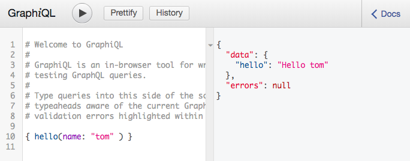

!!! Warning

    GraphQL support in Starlette is **deprecated** as of version 0.15 and will
    be removed in a future release. Please consider using a third-party library
    to provide GraphQL support. This is usually done by mounting a GraphQL ASGI
    application. See [#619](https://github.com/encode/starlette/issues/619).
    Some example libraries are:

    * [Ariadne](https://ariadnegraphql.org/docs/asgi)
    * [`tartiflette-asgi`](https://tartiflette.github.io/tartiflette-asgi/)
    * [Strawberry](https://strawberry.rocks/docs/integrations/asgi)
    * [`starlette-graphene3`](https://github.com/ciscorn/starlette-graphene3)

Starlette includes optional support for GraphQL, using the `graphene` library.

Here's an example of integrating the support into your application.

```python
from starlette.applications import Starlette
from starlette.routing import Route
from starlette.graphql import GraphQLApp
import graphene


class Query(graphene.ObjectType):
    hello = graphene.String(name=graphene.String(default_value="stranger"))

    def resolve_hello(self, info, name):
        return "Hello " + name

routes = [
    Route('/', GraphQLApp(schema=graphene.Schema(query=Query)))
]

app = Starlette(routes=routes)
```

If you load up the page in a browser, you'll be served the GraphiQL tool,
which you can use to interact with your GraphQL API.




## Accessing request information

The current request is available in the context.

```python
class Query(graphene.ObjectType):
    user_agent = graphene.String()

    def resolve_user_agent(self, info):
        """
        Return the User-Agent of the incoming request.
        """
        request = info.context["request"]
        return request.headers.get("User-Agent", "<unknown>")
```

## Adding background tasks

You can add background tasks to run once the response has been sent.

```python
class Query(graphene.ObjectType):
    user_agent = graphene.String()

    def resolve_user_agent(self, info):
        """
        Return the User-Agent of the incoming request.
        """
        user_agent = request.headers.get("User-Agent", "<unknown>")
        background = info.context["background"]
        background.add_task(log_user_agent, user_agent=user_agent)
        return user_agent

async def log_user_agent(user_agent):
    ...
```

## Sync or Async executors

If you're working with a standard ORM, then just use regular function calls for
your "resolve" methods, and Starlette will manage running the GraphQL query within a
separate thread.

If you want to use an asynchronous ORM, then use "async resolve" methods, and
make sure to setup Graphene's AsyncioExecutor using the `executor` argument.

```python
from graphql.execution.executors.asyncio import AsyncioExecutor
from starlette.applications import Starlette
from starlette.graphql import GraphQLApp
from starlette.routing import Route
import graphene


class Query(graphene.ObjectType):
    hello = graphene.String(name=graphene.String(default_value="stranger"))

    async def resolve_hello(self, info, name):
        # We can make asynchronous network calls here.
        return "Hello " + name

routes = [
    # We're using `executor_class=AsyncioExecutor` here.
    Route('/', GraphQLApp(
        schema=graphene.Schema(query=Query),
        executor_class=AsyncioExecutor
    ))
]

app = Starlette(routes=routes)
```
